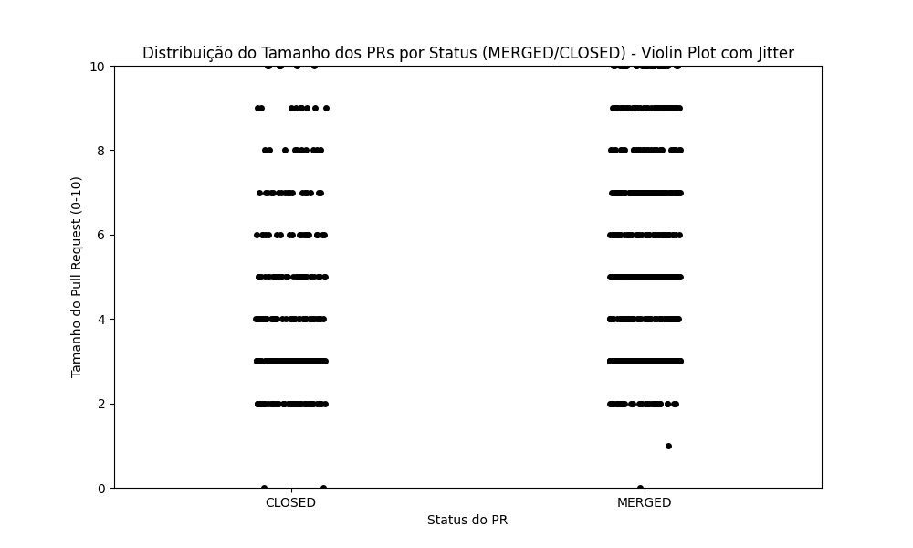
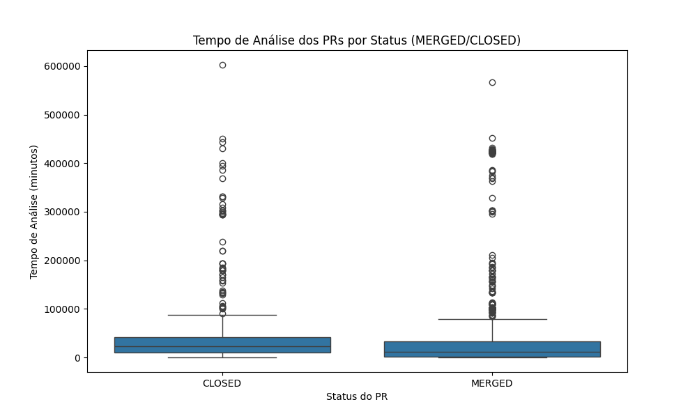
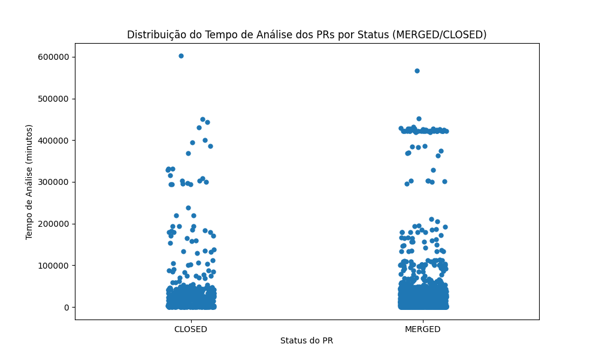
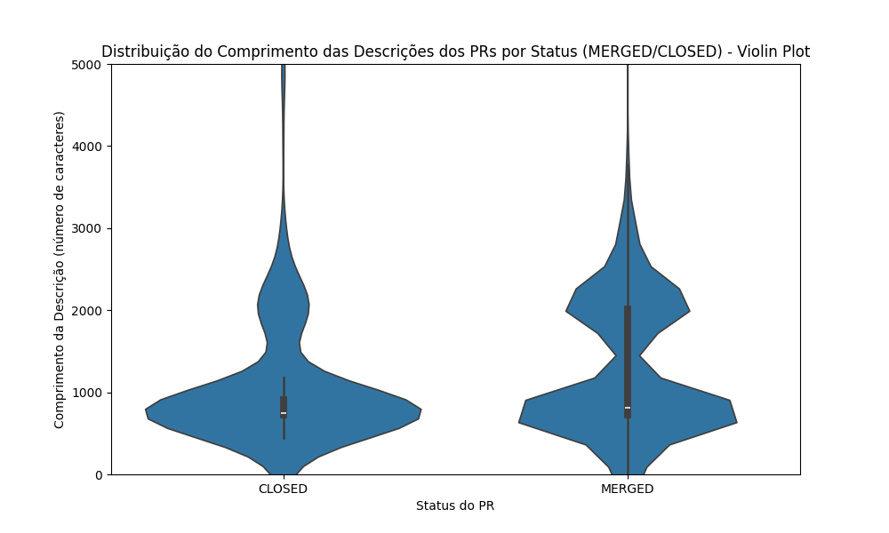
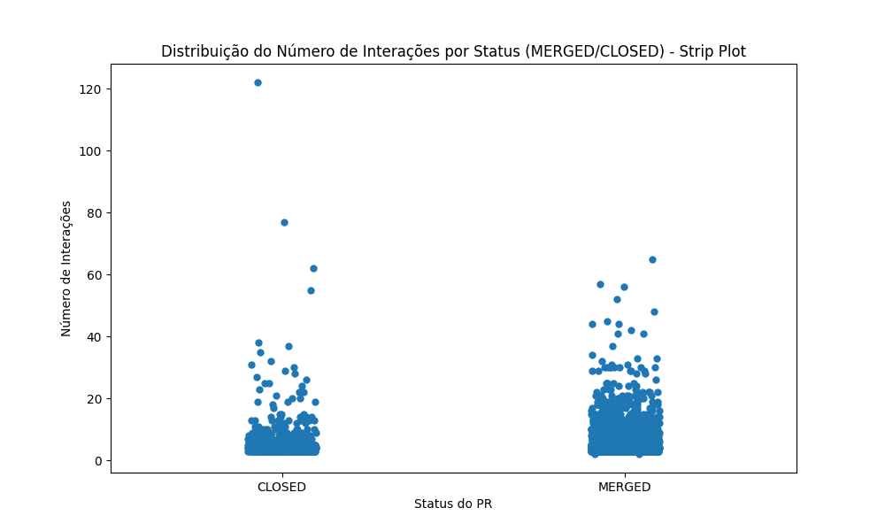
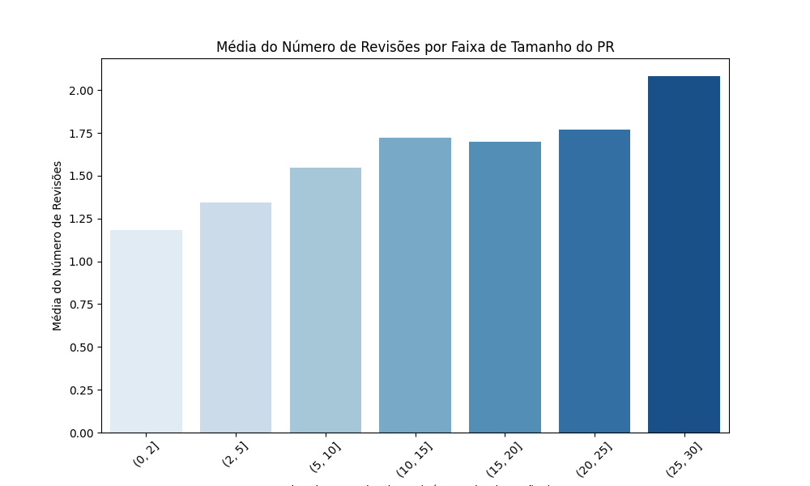
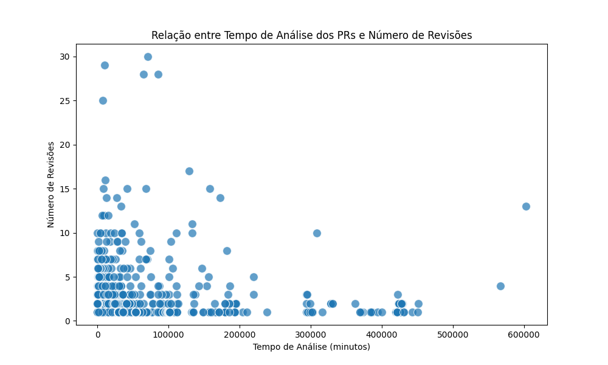
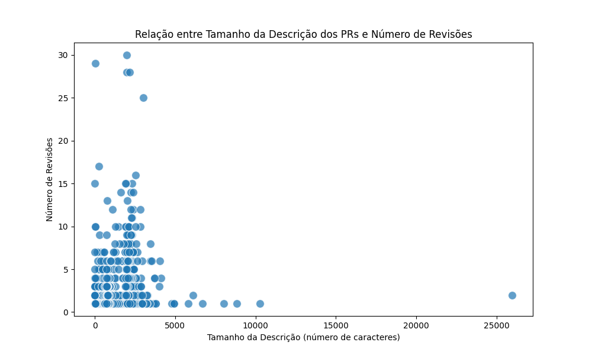
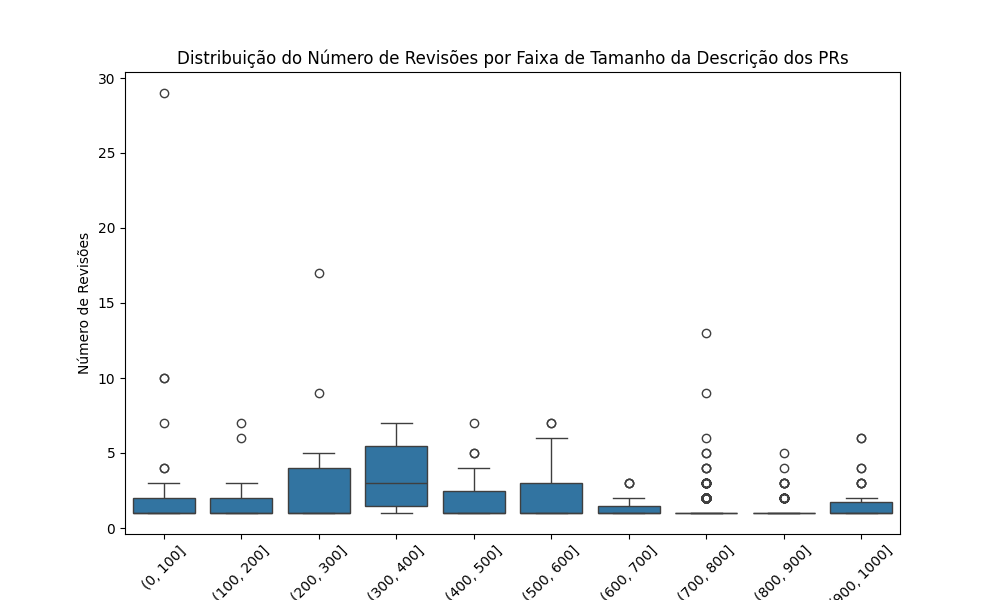
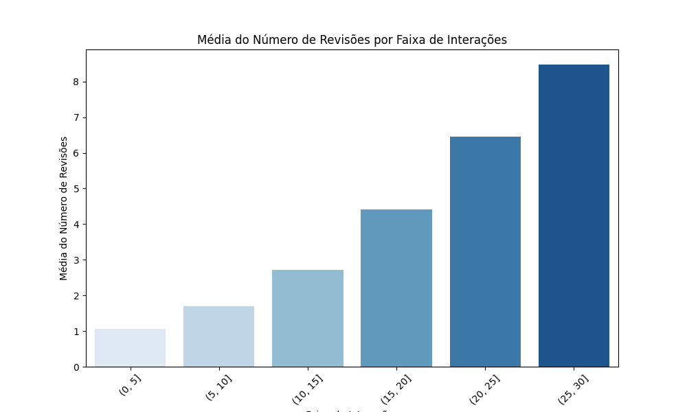

# Análise de Code Reviews de Repositórios Populares de Código Aberto no GitHub

## 1. Introdução

Neste trabalho, realizamos uma análise da atividade de code review desenvolvida em repositórios populares do GitHub. O objetivo principal é identificar variáveis que influenciam o merge de um Pull Request (PR) submetido nesses repositórios. Para isso, utilizamos um conjunto de PRs de repositórios populares do GitHub, filtrados por critérios específicos, a fim de responder às seguintes questões de pesquisa:

- **RQ 01**: Qual a relação entre o tamanho dos PRs e o feedback final das revisões?
- **RQ 02**: Qual a relação entre o tempo de análise dos PRs e o feedback final das revisões?
- **RQ 03**: Qual a relação entre a descrição dos PRs e o feedback final das revisões?
- **RQ 04**: Qual a relação entre as interações nos PRs e o feedback final das revisões?
- **RQ 05**: Qual a relação entre o tamanho dos PRs e o número de revisões realizadas?
- **RQ 06**: Qual a relação entre o tempo de análise dos PRs e o número de revisões realizadas?
- **RQ 07**: Qual a relação entre a descrição dos PRs e o número de revisões realizadas?
- **RQ 08**: Qual a relação entre as interações nos PRs e o número de revisões realizadas?

## 2. Hipóteses Informais

Com base nas características dos repositórios populares analisados, foram formuladas, de forma preliminar, as seguintes hipóteses, que serão validadas ao longo do estudo:

- Espera-se que PRs com menor quantidade de arquivos e linhas alteradas tenham maior probabilidade de serem aceitos.
- Espera-se que PRs analisados por mais tempo tendam a ter maior chance de rejeição.
- Espera-se que PRs com descrições detalhadas apresentem feedback mais positivo, pois tornam mais claro o entendimento da mudança.
- Espera-se que PRs com maior número de interações tenham maior probabilidade de serem aceitos em função do processo colaborativo de revisão.
- Espera-se que PRs com maior quantidade de arquivos e linhas alteradas necessitem de um número maior de revisões.
- Espera-se que PRs analisados por mais tempo tendam a passar por mais revisões antes de uma decisão final.
- Espera-se que PRs com descrições mais detalhadas apresentem menor número de revisões, pois tornam mais claro o entendimento da mudança e reduzem a necessidade de análises subsequentes.
- Espera-se que PRs com maior número de interações apresentem maior número de revisões, já que discussões extensas frequentemente resultam em ajustes e revisões adicionais.

## 3. Metodologia

### 3.1. Criação do Dataset

A coleta de dados foi realizada a partir da API do GitHub e implementada via GraphQL, buscando os 200 repositórios com maior número de estrelas, filtrados a partir dos seguintes critérios de seleção:

- Repositórios com pelo menos 100 PRs (mergeados ou fechados).
- PRs com status de `MERGED` ou `CLOSED`, que passaram por pelo menos uma revisão (campo `review` com valor maior que zero).
- PRs cuja revisão tenha levado mais de uma hora, eliminando assim revisões automáticas (como bots ou ferramentas de CI/CD).

Exemplo de objeto JSON obtido após extração e manipulação de dados de Pull Requests e seus atributos, utilizados para cálculo das métricas:

```json
{
  "objectId": "8f17a2ca-039f-4a5d-934a-6189989fa56e",
  "repositoryName": "freeCodeCamp",
  "ownerName": "freeCodeCamp",
  "author": "ahs-atan",
  "state": "MERGED",
  "createAt": "2018-10-19T08:45:30Z",
  "closetAt": "2018-11-17T10:04:49Z",
  "mergedAt": "2018-11-17T10:04:49Z",
  "changedFiles": 1,
  "deletions": 0,
  "additions": 4,
  "description": "Some links I found useful for learning and understanding Java Inheritance:\r\n - https://www.codejava.net/java-core/the-java-language/12-rules-and-examples-about-inheritance-in-java\r\n - https://medium.com/java-for-absolute-dummies/inheritance-in-java-programming-39176e0016f3\r\n\r\n\r\n",
  "participantsCount": 3,
  "commentsCount": 0,
  "reviewsCount": 1
}
```

### 3.2. Definição de Métricas

Para cada pergunta de pesquisa, utilizamos as seguintes métricas para avaliar as correlações:

- **Tamanho do PR**: número de arquivos modificados e total de linhas adicionadas e removidas.
- **Tempo de Análise**: intervalo de tempo entre a criação do PR e sua última atividade (merge ou fechamento).
- **Descrição**: número de caracteres no 'body' da descrição do PR (em markdown).
- **Interações**: número de participantes no PR e o número de comentários feitos.

## 4. Resultados e análise

### 4.1. Tamanho dos PRs x Feedback final das revisões (RQ 01)



A visualização de dados indica que PRs menores (tamanho 2) podem ter uma ligeira preferência em serem mergeados em relação a PRs mais longos. Ademais, no topo da escala (tamanhos 8-10), é possível visualizar um contraste maior entre PRs maiores, que tendem a ser mais mergeados do que fechados.

### 4.2. Tempo de análise dos PRs x Feedback final das revisões (RQ 02)




Os gráficos indicam que PRs que passam por longos períodos de análise (na ordem de 600.000 minutos) têm uma chance maior de serem fechados sem merge, enquanto PRs que são mergeados tendem a ter tempos de análise mais curtos, entre 0-200.000 minutos. Pode-se concluir, portanto, que há indícios de uma correlação entre PRs analisados rapidamente e uma maior chance de aprovação, confirmando a hipótese inicial de que PRs analisados por mais tempo tenderiam à rejeição.

### 4.3. Descrição dos PRs x Feedback final das revisões (RQ 03)



É possível inferir, por meio da visualização de dados, que PRs cuja descrição é de até 1.000 caracteres possuem a tendência de serem fechados sem merge. Por outro lado, PRs que apresentam descrição de tamanho moderado (2.000 a 3.000 caracteres) têm maior chance de serem mergeados. Quanto aos PRs de descrições longas, não é possível identificar disparidade significativa quanto à sua tendência de merge.

### 4.4. Interações nos PRs x Feedback final das revisões (RQ 04)



É evidente o contraste entre PRs cujas interações se encontram na ordem de 20 a 60, uma vez que estes possuem significativa tendência de serem mergeados, confirmando a hipótese inicial de que o processo colaborativo de revisão favorece aprovações. No entanto, é possível observar alguns outliers — PRs com elevado histórico de interações, porém com status de fechado.

### 4.5. Tamanho dos PRs x Número de revisões realizadas (RQ 05)



O gráfico indica uma correlação aproximadamente linear entre o tamanho dos PRs e a quantidade de revisões, mostrando que, à medida que a quantidade de modificações cresce, o número de revisões também se eleva proporcionalmente. Essa tendência confirma a hipótese inicial de que PRs com maior quantidade de arquivos e linhas alteradas necessitariam de um número maior de revisões durante o processo de Code Review.

### 4.6. Tempo de análise dos PRs x Número de revisões realizadas (RQ 06)



A visualização permite inferir que PRs com menor tempo de análise tendem a receber menos revisões, considerando a grande concentração de instâncias próximas aos eixos do gráfico. Também é possível perceber alguns outliers — PRs que, embora analisados por pouco tempo, passaram por uma quantidade alta de revisões.

### 4.7. Descrição dos PRs x Número de revisões realizadas (RQ 07)




Ao analisar os gráficos, percebe-se indícios de que PRs com menor descrição tendem a receber menos revisões, refutando a hipótese inicial de que PRs com descrições mais sucintas ou vagas poderiam ser mais propensos a enfrentar dificuldades durante o processo de revisão.

### 4.8. Interações nos PRs x Número de revisões realizadas (RQ 08)



O gráfico indica uma correlação aproximadamente linear entre o número de interações e a quantidade de revisões, apontando uma relação de proporcionalidade. Essa tendência valida a hipótese inicial de que PRs com mais interações tendem a passar por um número maior de revisões, uma vez que discussões mais longas geralmente levam a ajustes e revisões adicionais.
